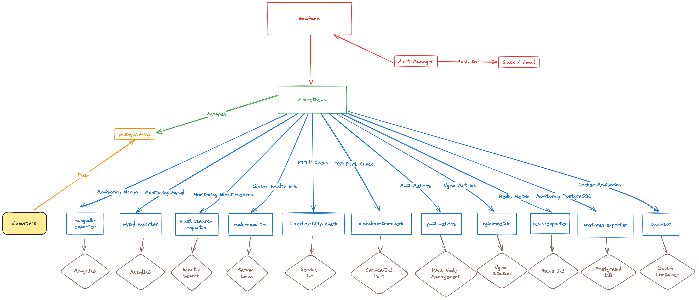

# Dev Monitoring Stack

This repository provides a Docker Compose configuration to set up a comprehensive monitoring stack using Prometheus, Grafana, Alertmanager, Node Exporter, and Blackbox Exporter.



## Introduction

Our monitoring stack helps you monitor applications and systems effectively. It includes the following services:

- **Grafana:** A powerful interface for visualizing monitoring data.

- **Prometheus:** A real-time database for storing monitoring data.

- **Blackbox Exporter:** Monitors endpoints for availability and response times.

- **Alertmanager:** Manages alerts and notifications.

- **Node Exporter:** Collects server metrics for hardware and OS monitoring.

- **Other Exporters:** Monitor various applications like MongoDB, MySQL, Elasticsearch, PM2, and more.

## Requirements

Ensure you have Docker and Docker Compose installed.

## Quick Setup

1. Clone this repository:

   ```shell
   git clone
   cd system-monitoring-grafana
   ```

   Customize environment variables in .env as needed.
   Start the stack: `docker-compose up -d`

2. Access components:

- Grafana: http://localhost:3002 (Login credentials in .env)
- Prometheus: http://localhost:9090 (Login credentials in prometheus/web.yml)
- Alertmanager: http://localhost:9093
- Node Exporter metrics: http://localhost:9100/targets
- Blackbox Exporter metrics: http://localhost:9115/targets

## Configuration

### Grafana

- Customize Grafana settings in grafana/grafana-config/grafana.ini.
- Dashboards for various monitoring services are in grafana/dashboards. You can add, remove, or edit these dashboards to suit your needs.
  > Caution: Set permissions for grafana storage `sudo chown -R 472:0 grafana/grafana-storage`

### Prometheus

- Configure Prometheus in prometheus/prometheus.yml.
  Add or remove scrape configurations for services like MongoDB, MySQL, Elasticsearch, Blackbox, and more.
- Prometheus Alert rules at prometheus/rules/\*.yml

### Alertmanager

- Manage Alertmanager settings in alertmanager/config.yml
- Customize routes, receivers, and notification channels.

### Adding Services

> To include or exclude monitoring services (e.g., Redis, Postgres, Elasticsearch, Mysql, MongoDB, Kafka), edit docker-compose.yml.

- Node Exporter for Server Monitoring

  Set up Node Exporter to collect data from multiple servers and centralize the monitoring.

  ```sh
  # Install this package per each node servers
  sudo apt install prometheus-node-exporter
  # Now check the node exporter is running at port 9100

  sudo service prometheus-node-exporter status
  # You can stop, start or restart a node exporter
  ```

- Blackbox Exporter for Health Check Monitoring

  Customize the targets in the Blackbox Exporter configuration (blackbox/blackbox.yml) to specify the endpoints you want to monitor.
  Add URLs, IPs, or hostnames of the services you wish to check. You can configure additional parameters like module and timeout to suit your monitoring needs.

  > Optionally, set up specific relabeling configurations for Blackbox Exporter in the Prometheus configuration (prometheus/prometheus.yml) if necessary.

- You can further customize scrape configurations for various jobs, such as MongoDB, MySQL, Elasticsearch, Blackbox, and more, in the prometheus/prometheus.yml file.

### Advanced Configurations

- Further customize Grafana and Prometheus in their respective directories.
- Fine-tune Prometheus scrape configurations for specific services.
- Explore advanced configurations for Slack integration and custom alert messages in the conversation above.
- The Alertmanager configuration is defined in the alertmanager/config.yml file. You can customize routes, receivers, and notification channels according to your needs. The advanced configurations for integrating Slack, customizing alert messages, and more.

### Monitoring Targets

- Node Exporter: Collects server metrics, including CPU, memory, disk, and network usage.
- Blackbox Exporter: Monitors service availability and response times for specified endpoints.

## Learn More

- [Grafana](https://github.com/percona/grafana-dashboards/tree/pmm-1.x/dashboards)
- [Alertmanager](https://samber.github.io/awesome-prometheus-alerts/alertmanager)
- [Prometheus](https://prometheus.io/docs/prometheus/latest/configuration/configuration/)
- [Blackbox Exporter](https://github.com/prometheus/blackbox_exporter)
- [Node Exporter](https://devopscube.com/monitor-linux-servers-prometheus-node-exporter/)
- [PM2-metric Exporter](https://github.com/saikatharryc/pm2-prometheus-exporter)

## License

This project is distributed under the MIT License.
